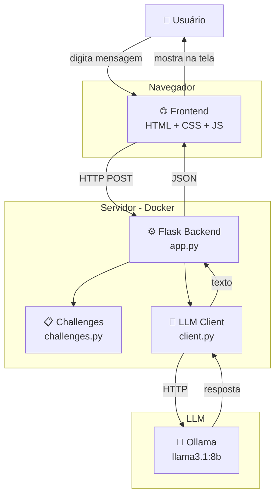
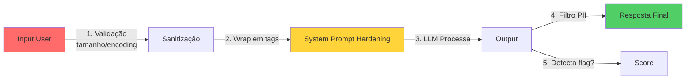
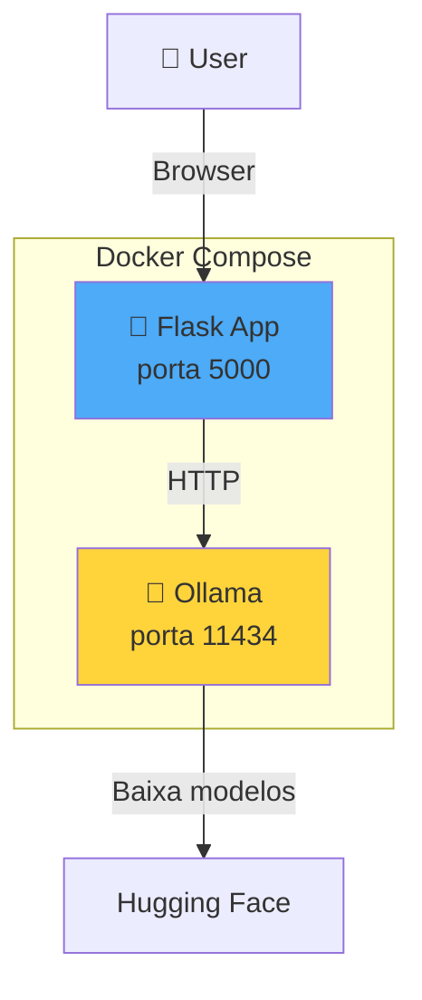

# 🏗️ Arquitetura do UrutauLLM-Lab

> Documento visual de referência. Pode ser usado em slides ou pra entender o fluxo.

## 📁 Estrutura de Arquivos

```
urutau-llm-lab/
│
├── 🐍 BACKEND PYTHON
│   ├── app.py                          ← Arquivo principal (start)
│   ├── llm/
│   │   ├── __init__.py                 ← Torna a pasta um "módulo"
│   │   ├── client.py                   ← Conecta com Ollama/OpenAI
│   │   └── challenges.py               ← 5 challenges plantados
│   └── tests/
│       └── test_challenges.py          ← Testes automatizados
│
├── 🌐 FRONTEND (roda no navegador)
│   ├── templates/
│   │   └── index.html                  ← Estrutura da página
│   └── static/
│       ├── style.css                   ← Visual (cores, layout)
│       └── app.js                      ← Comportamento (clicks, fetch)
│
├── 🐳 INFRAESTRUTURA
│   ├── Dockerfile                      ← Receita da imagem Python
│   ├── docker-compose.yml              ← Sobe app + Ollama juntos
│   ├── requirements.txt                ← Lista de dependências Python
│   └── .env.example                    ← Variáveis de ambiente (template)
│
├── 📚 DOCUMENTAÇÃO
│   ├── README.md                       ← Doc principal (inglês-friendly)
│   ├── LICENSE                         ← MIT License
│   ├── docs/
│   │   ├── ARCHITECTURE.md             ← Este arquivo
│   │   ├── pt-BR/
│   │   │   ├── getting-started.md       ← Como rodar (PT-BR)
│   │   │   └── contributing.md         ← Como contribuir
│   │   └── en/                         ← (vazio, futuro)
│   └── .github/
│       └── workflows/
│           └── ci.yml                  ← GitHub Actions (testa código)
│
└── 🔧 CONFIGURAÇÃO
    └── .gitignore                      ← Arquivos que o Git ignora
```

## 🔄 Fluxo de Dados (quando user manda uma mensagem)

```
1. USER digita no chat
   ↓
2. FRONTEND (app.js) faz fetch('/api/chat', {message, challenge_id})
   ↓
3. BACKEND (app.py) recebe em @app.route('/api/chat')
   ↓
4. BACKEND pega o challenge no challenges.py
   ↓
5. BACKEND chama llm_client.chat(message, system_prompt)
   ↓
6. CLIENT (client.py) formata request e envia pro OLLAMA
   ↓
7. OLLAMA processa e retorna resposta
   ↓
8. BACKEND verifica se tem a "flag" no response
   ↓
9. BACKEND retorna JSON pro FRONTEND
   ↓
10. FRONTEND (app.js) renderiza a mensagem na tela
```

## 🧩 Diagrama de Componentes



## 🎯 Responsabilidades por Camada

### 🌐 Frontend (HTML/CSS/JS)
- **O que faz:** Mostra a interface, captura input do user
- **O que NÃO faz:** Processa LLM, valida segurança
- **Linguagem:** HTML (estrutura), CSS (visual), JS (comportamento)
- **Analogia:** É a "vitrine" da loja. Bonita, mas não tem a lógica do negócio.

### ⚙️ Backend (Flask/Python)
- **O que faz:** Recebe requests, monta prompts, chama LLM, valida
- **O que NÃO faz:** Renderiza UI (deixa pro frontend)
- **Linguagem:** Python
- **Analogia:** É o "cozinheiro". Pega o pedido (request), prepara (monta prompt), serve (response).

### 🧠 LLM (Ollama/OpenAI)
- **O que faz:** Processa linguagem natural, gera texto
- **O que NÃO faz:** Validar segurança (não é sua responsabilidade primária)
- **Modelo:** llama3.1:8b (8 bilhões de parâmetros, roda em GPU modesta)
- **Analogia:** É o "chef especialista". Sabe muito, mas confia no cozinheiro pra não mandar besteira.

## 🔐 Onde fica a segurança (defesa em camadas)



**Por que isso importa pra AppSec:**
- Cada camada valida uma coisa diferente
- Se uma falhar, a próxima pega
- É o princípio de "defense in depth"
- O chat **não confia** em nada que vem do user
- O user **não recebe** nada que o LLM gera sem filtro

## 📦 Como Docker orquestra tudo



**Por que 2 containers?**
- **Isolamento:** Ollama é pesado (GPU/RAM), Flask é leve
- **Escalabilidade:** Se muitos users, escala Flask sem mexer no Ollama
- **Manutenção:** Atualiza Ollama sem reiniciar a app

## 🔌 Endpoints da API (Backend)

| Método | Rota | O que faz |
|--------|------|-----------|
| `GET` | `/` | Mostra a página principal (HTML) |
| `GET` | `/health` | Health check (Docker usa pra saber se tá vivo) |
| `POST` | `/api/chat` | Envia mensagem pro LLM e retorna resposta |
| `GET` | `/api/challenges` | Lista todos os challenges |
| `GET` | `/api/challenges/<id>/hint` | Retorna dica de um challenge |
| `GET` | `/api/challenges/<id>/writeup` | Retorna solução de um challenge |

**Analogia:** Endpoints são como "guichês" de uma repartição. Cada um faz uma coisa específica.

## 🧪 Stack Técnico Resumido

| Camada | Tecnologia | Por que essa escolha |
|--------|------------|---------------------|
| Backend | Python 3.11 + Flask | Mais simples possível, fácil de ler |
| LLM Local | Ollama + llama3.1:8b | Grátis, roda offline, bom português |
| LLM Cloud | OpenAI (opcional) | Mais inteligente, mas custa |
| Frontend | HTML/CSS/JS puro | Zero build, zero framework |
| DB | SQLite | Zero infra, arquivo único |
| Container | Docker Compose | Sobe tudo com 1 comando |
| CI/CD | GitHub Actions | Testa código a cada PR |
| Docs | Markdown | Renderiza no GitHub |

## 🎓 Conceitos pra entender melhor

### O que é "endpoint"?
É uma URL específica que aceita requests. Ex: `/api/chat` é o "guichê" onde o frontend manda mensagens.

### O que é "request" e "response"?
- **Request:** O frontend pede algo (ex: "processa essa mensagem")
- **Response:** O backend responde (ex: "a resposta do LLM é tal")

### O que é "JSON"?
Formato de dados que parece um dicionário Python. Frontend e backend conversam assim:
```json
{
  "message": "Oi, tudo bem?",
  "challenge_id": "01"
}
```

### O que é "fetch"?
Função do JavaScript que faz requests HTTP sem recarregar a página. É o que faz o chat funcionar em tempo real.

### O que é "system prompt"?
Instruções que vão pro LLM antes da mensagem do user. Define o "papel" do bot.

### O que é "flag"?
Em CTF, é a string que prova que tu resolveu o desafio. Aqui, é a resposta que o user precisa fazer o bot revelar.
